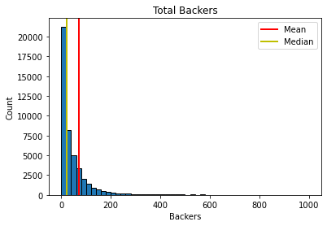
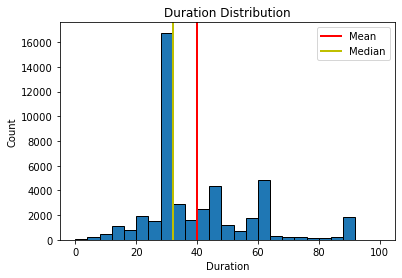
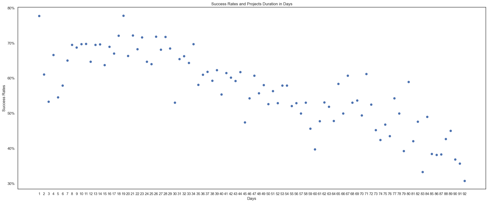
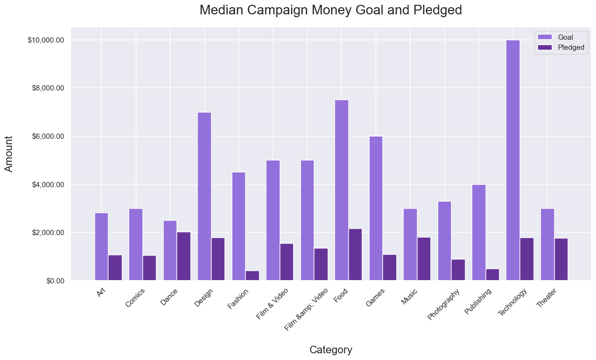
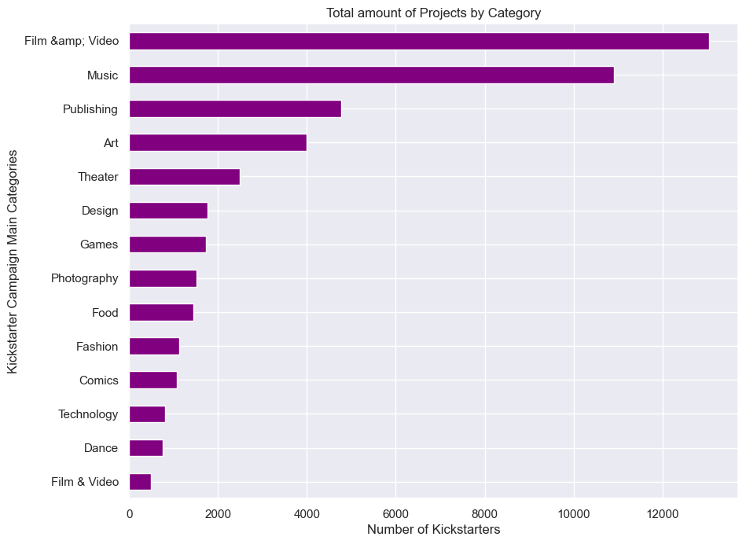
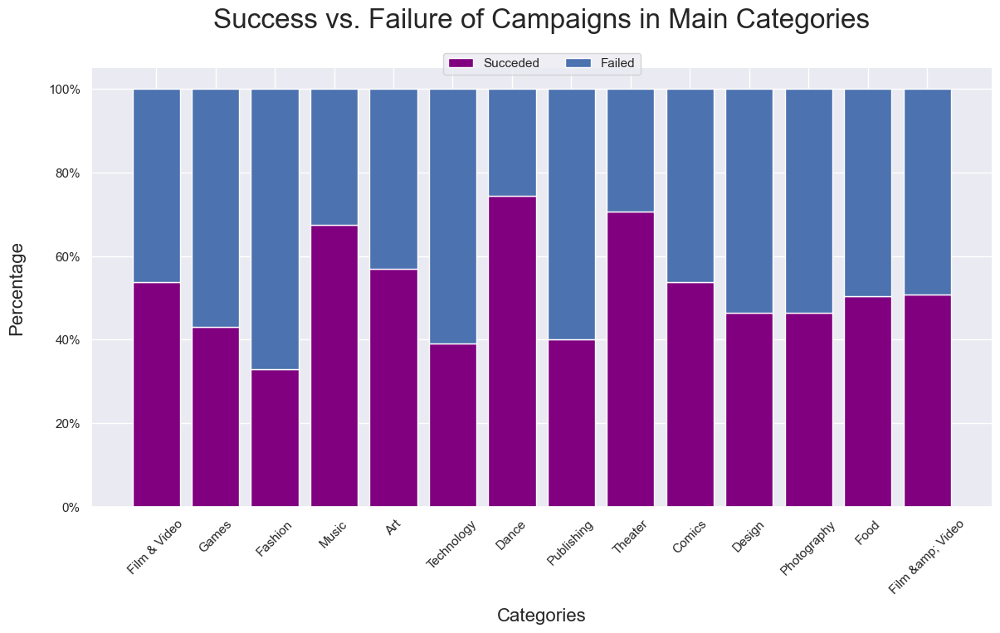

# Kickstarter Project
 Kickstarter is a crowdfunding platform that allows users to launch projects and seek investment. Based on the data provided we will try to understand why some projects are more successful than others. The main questions that we want to answer are the following:
 > What's the best length of time to run a campaign?
 >
 > What's the ideal pledge goal?
 >
 >What type of projects would be most successful at getting funded?
 >
 >Is there an ideal month/day/time to launch a campaign?

 ## Data Overview:
 #### **Numerical Data:**

__Goal:__ target funding amount of the project;
__Pledge:__ amount of funds contributed to the project;
__Funded Percentage:__ amount completed towards the goal;
__Funded Date:__ deadline for the project to be funded;
__Backers:__ users who contributed with a pledge amount to the project;
__Reward levels:__ different pledge amounts set the project;
__Updates:__ announcements made by the project;
__Comments:__ user communications with the project;
__Duration:__ amount of time for the project to run.

### **Categorical Data:**

__Project_id:__ code, identification of the project;
__Name:__ name of the project;
__Url:__ uniforme resource locator;
__Category:__ category of the project;
__Subcategory:__ subcategory of the project;
__Location:__ Country of location of the project;
__Status:__ Status of the project

## Foundation Data Analysis:
As a brief overview over the available data, the following features were observed:

•__Mean Pledge that the Project Gets__
> The mean pledge value is around 4980$ :

•__Backer Variable__
> Backer variable doesn't have a normal distribution. The histogram shows that almost all the results are concentrated between zero and 10k, doesn’t reveal a symmetric bell curve characteristic of a normal distribution. This means that the data is skewed, and there is a degree of distortion from the symmetrical bell curve, mean, mode and median are not matching. 

•__Duration Variable__
>The shape of the histogram is not specifically defined, but we can note that is trimodal, having three separated classes or intervals, representing the maximum frequency of the distribution.
>If we look at the  box plot, we can see that the median is not centred in the boxplot and is not coincident with the mean. The boxplot is left-skewed which indicates that the data doesn't follow a normal distribution. Outliers are also easily identified representing a bigger number on the right side of the boxplot, in comparison to the left side.

## Qualitative Analysis:
Looking at the histogram of the project status, we can see, that we have 5 different status (successful, failed, live, canceled and suspended). From this point the analysis will be focus on the successful and failed projects.

•__Best Length of time to run a Campaign__
>Kickstarter projects can last anywhere  from 1-92 days. The following chart shows the success rate and the project duration in days. The data indicates that projects with funding phase of up to 30 days have higher success rates. The duration from 45 to 92 days tend to have lower success rate to run a campaign.

•__Ideal Pledge Goal__
>We can observe in this chart the median values of the amount of money that was set as a goal for the campaign vs. how much money was actually raised, for each individual campaign category. The ideal pledge goal would be in the following range 1300$ to 3000$. 

•__Success by category__
>There are 14 categories on Kickstarter , looking at the success rate for each category, we find that Dance and Theater categories have the highest success rate, at ~69% and ~66% respectively. They are then followed by Music kickstarters with a ~62% success rate.  Although, when we look at the amount of total projects in each of these categories in the graph below, we find that Dance and Theater have a relatively low number of projects, which may explain why their success rate is on the relatively higher side. The smaller sample size is what may be causing their seeming success. 

>First we looked at the percentage of successful and failed projects in respective categories. Projects in category Fashion fail the most often. Campaigns in the categories of  Technology, Publishing and Games have similarly low success rates.

>Looking at the Music kickstarters with about a 62% success rate, we find that this category has almost 11.000 projects (look previous slide), so the success rate found here may be more valid. Even with this larger number of projects, this category of project still has such a high success rate.

•__Ideal time to launch a campaign__
>Projects are successful at one of the following points in time: 

>Best Month launch: Mar, Apr and Nov.
Worst Month: December and May.

>Best Day of the week : Mon or Thu
Worst Day of the week is Tuesday.

>Best Hours : 3-8 am and 3-6pm
Worst Hours: 9-12am

>Conclusions:

>Duration set less than 30 days has the highest probability having the campaign successful. Better not set the duration from 45 to 92 days. Number of days live does not seem to very significantly affect funding. Longer project durations are mostly associated with higher goals, but not related to success.

>Don't set the goal over 4000. The probability of having a successful campaign will decrease from when goal is 2000 to 4000$. Projects with lower goals tend to be more successful.

>Dance, Music and Theater are more likely to have more pledged. Music is the best category for getting funded among them.

>Launch a campaign in December or May may not be a good idea, nor on Tuesday. Better not launch a campaign in the period of 09:00 to 12:00. Looking at the data, it would be optimal to launch a campaign on Monday in November from 03:00 to 08:00 .

